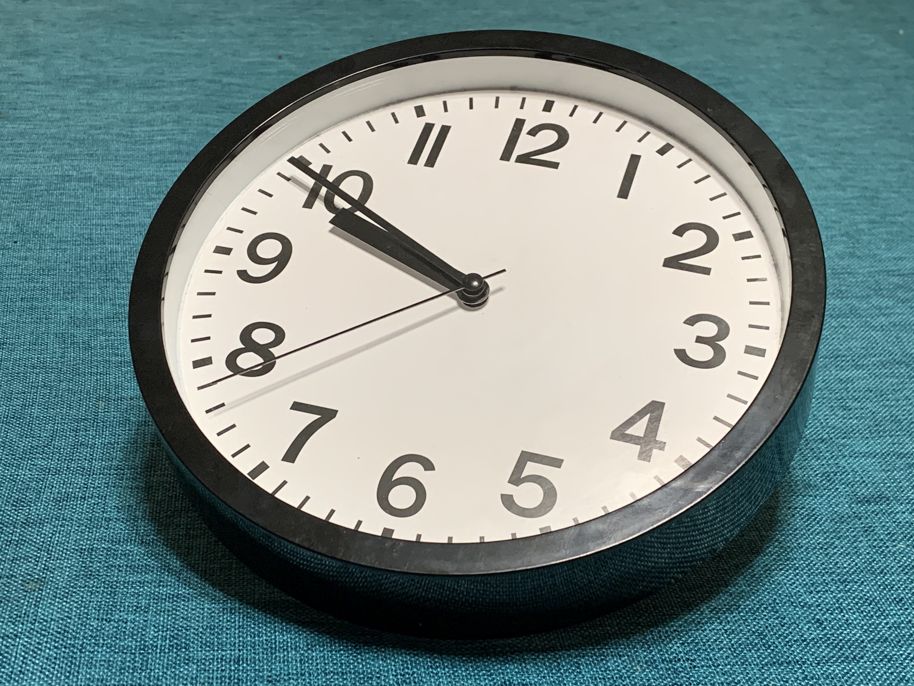
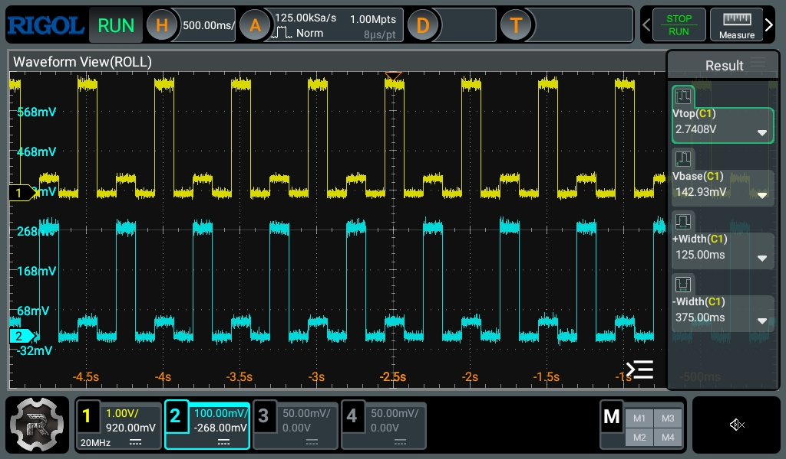
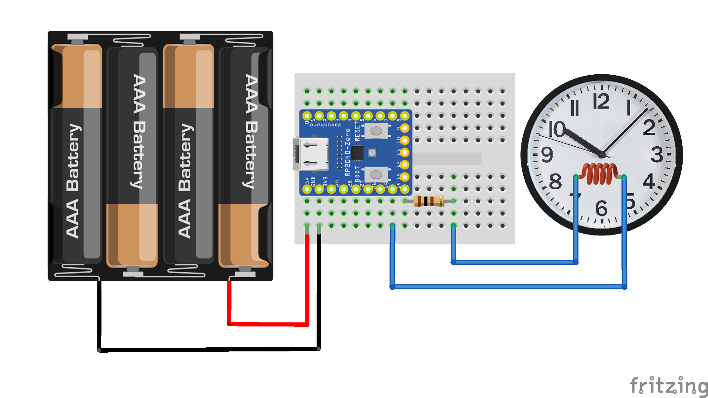
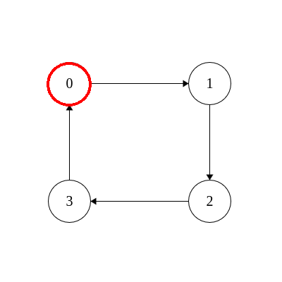
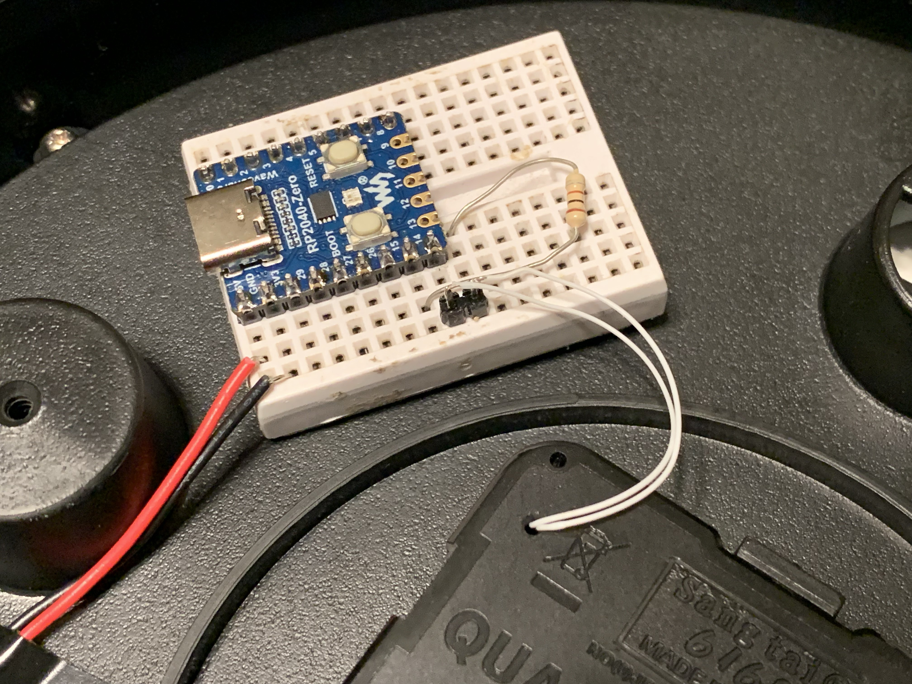
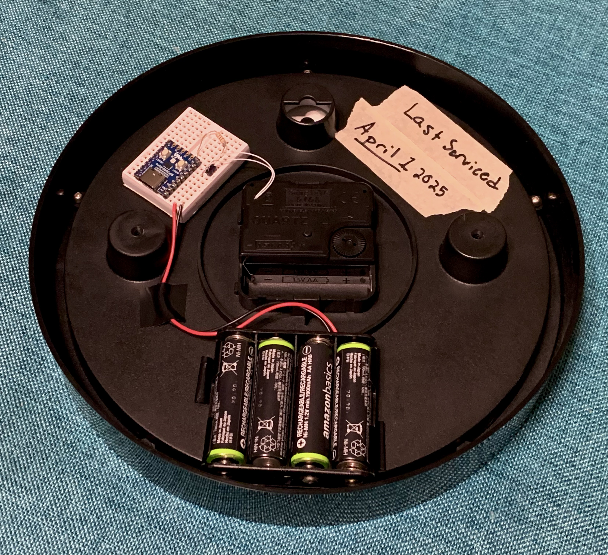
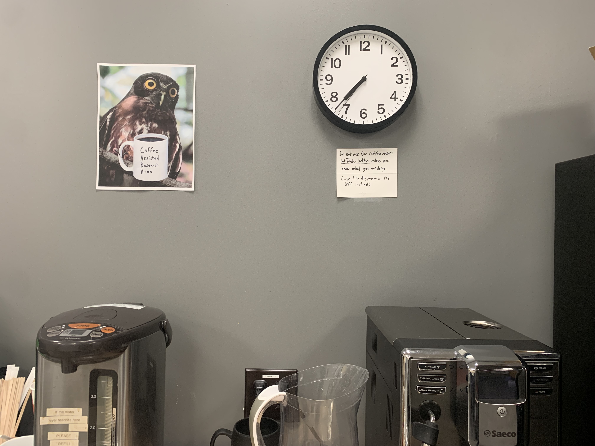
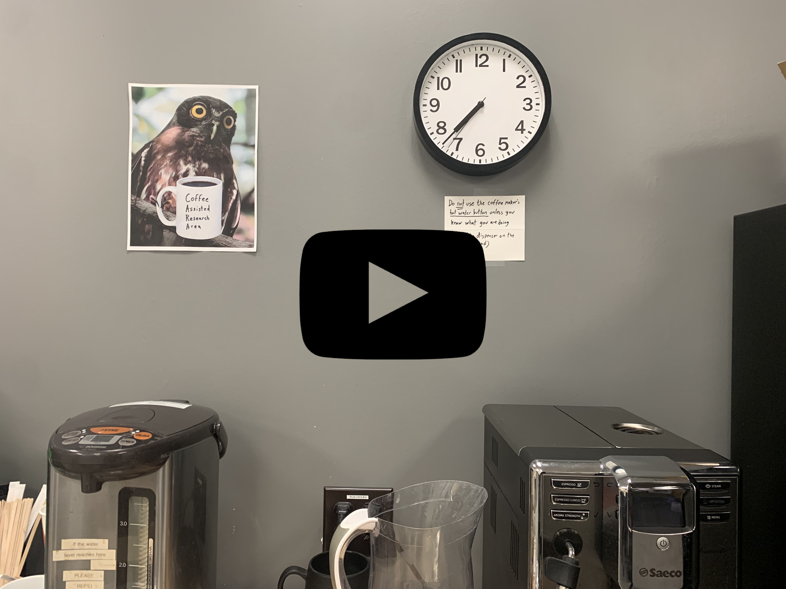

# Ventinari Clock: Functional Malfunctional Timekeeping
**Date of Last Calibration: April 1, 2025**

# The Goal
Ever since I saw a [Hackaday post](https://hackaday.com/2011/10/06/vetinari-clock-will-drive-you-insane/) many many years ago about a clock designed to drive you mad, I knew I wanted one. Last fall, I decided the time would be right on [April 1st, 2025](https://en.wikipedia.org/wiki/April_Fools%27_Day). I blessed my computer science research lab with a clock that is clearly erratic, yet keeps time just fine. Installed the night before, it graced the wall above the coffee machine and presided over undergraduate office hours.

This is the result. A 5 dollar clock from Target with a Pi Pico (RP2040) clone as the brains, designed to tick randomly with a average rate of one tick per second. This project is quick and dirty, banged out in an evening for only one day in the limelight. Shortcuts were taken, power was not optimized, and the overall mantra was "good enough". Oh and it's written in Rust, because why not? I also do research on strongly typed programming languages, so maybe I'm biased here.

The code's all here and a build-log follows below. If you feel like you need this in your (or your victim's) life, the design is for the taking. Would I recommend using my code? No. Will it break after a few days because I'm abusing both of the two components? Maybe. Can you do it anyway? Sure, why not.

# Driving a Clock
The first task is to control the clock from a microcontroller. Luckily your typical quartz clocks are very very simple. Buried inside the plastic housing, nestled beneath quite a chain of tiny plastic gears, is a minimal PCB. On it lives a epoxy blob IC, a trimmed quartz crystal, invariably 32.768 kHz, and a solenoid-like coil wrapped around a metal core. This chip's purpose in life is to divide by 32768 (aka 2^15) and create a pulse through the coil once per second. These pulses reverse polarity every tick. The effect is to turn a tiny rotor 180 degrees each time. The gearwork translates this into the motion of the hour, minute, and second hands.

Thus to drive the clock programmatically, we need to supply these pulses. The alternating polarity is needed to flip the rotor around each time. Without reversing it, the rotor would align with the field of this electromagnet and then stay put. The _correct_ way to do this is with an H-bridge. That sounds like effort, so we'll just kludge it in software. Each end of the coil goes to a GPIO pin on the RP2040. These are kept low (push-pull mode), and each we pulse one high. By alternating which pin goes high, we create the alternate polarity pulses the coil needs. On the oscilloscope, it looks like this:

To give the chip a little cushion from the inductive load, I also threw in a 100 ohm resistor in series. These clockworks are designed to be low power. The coil doesn't need that much current to tick. To make things a little smoother, I also reduced the GPIO drive strength to 2 mA --- the lowest setting on the RP2040. I had the whole thing disassembled (but forgot to take pictures), so tacking some tiny wires to the coil's PCB pads was a 30 second adventure with the soldering iron. Below I've used the pinnacle of hardware design software, Fritzing, to show exactly how simple this all really is. With that done, we've now got control over the ticks.

# Keeping Time With Markov Chains
With the tick out of the way, next comes the randomness. I wanted something more erratic than subtle so the clock gets some attention. Simplicity and expediency are the goals, so I didn't want a complicated algorithm. We need the clock to keep reasonable time for about 24 hours. An ideal algorithm wouldn't rely on tracking the drift or history, be as simple as a lookup table, and be easy to verify and tune. Clearly the solution is AI --- _retro AI_.

If you remember the spam of the 00's and the gibberish inside designed to fool statistical spam filters, you're familiar with the venerable Markov chain. It's just a state machine, where the transitions are probabilistic. Using the tiniest bit of linear algebra, we can compute the frequency of each state. I settled on a 4-state model where all the transition probabilities are fractions with a denominator of 16. This means taking a step just needs a 4x16 lookup table and a 4-bit random number. The base state machine with just the "normal" transitions looks like this:

Now we just need to add the wacky edges. First though, we need a matrix. I'm sure there's some fancy method for computing one that keeps good time. I went with the classic "change the numbers and see what happens". It's all about the vibes. Waiting around to measure the drift was a little too slow. So I threw together a Python script to do some math and give me a little simulated clock sound. The mechanism is simple. We randomly transition four times per second and tick whenever we hit state 0.

To determine the average drift, we just need to know what the ratio of state 0 is to the total number of transitions. Markov made this easy. Multiplying a vector representing the probability of being in each state by the transition matrix computes the probability of each following state. The tiny bit of linear algebra tells us that exponentiating the transition matrix converges to the steady state probabilities. In practice, this means multiplying the matrix by itself a bunch of times will tell us how often we enter each state. Using `numpy.linalg.matrix_power(trans, 1000)` and summing up the first column gives us the average tick rate. The simulation is in [`clock.py`](clock.py).

Using this and a pygame simulation that plays a tick, I can see both the average drift and get a feel for the randomness. I didn't bother working out the math to calculate the variance. Python can run a few dozen 1-day simulations and give me a feel for the spread. I'm perfectly happy with a minute or two of drift during the 36 hour run. Poking around for an hour, I settled on the following transition matrix. The ticking is erratic and unpredictable, yet it all averages out to one tick per second.

$$ T =
\begin{bmatrix}
	\frac{ 1}{16} & \frac{14}{16} & \frac{ 0}{16} &\frac{ 1}{16} \\
	\frac{ 1}{16} & \frac{ 1}{16} & \frac{13}{16} &\frac{ 1}{16} \\
	\frac{ 0}{16} & \frac{ 0}{16} & \frac{ 2}{16} &\frac{14}{16} \\
	\frac{14}{16} & \frac{ 1}{16} & \frac{ 1}{16} &\frac{ 0}{16} \\
\end{bmatrix}
$$

# Implementation

The code is bad. I'm not going to claim otherwise. The transition matrix becomes a 4x16 lookup table. A linear-feedback shift register provides the randomness. I just grabbed the example constants off Wikipedia. Using the PWM peripheral as a timer, we generate an interrupt at 8 Hz. Every other interrupt, we grab 4 bits of randomness from the LFSR. This becomes an index into the current state row of the transition lookup table. The result is the next state. Since all of the probabilities have a denominator of 16, we the numerator tells us how many times that state should appear in the row. This gives us our weighted random transition.

If the lookup sends us to state zero, we need to tick the second hand. We keep a flag to track the alternating polarity and drive the corresponding pin high.  Every other interrupt sets both low. The result is a 125 ms pulse, very close to the original clock waveform.
For debugging, I also blink an LED and log the number of times we enter each state over a USB serial port. Is this a lot for an interrupt handler? Yes. Do I care? No.

Getting things up and running on the bench, with an LED for visual feedback:

I'm going to take a quick aside and rant about GitHub Copilot and using LLMs to program embedded systems. In short, I tried it and it was a bad experience. I'm working in Rust so the available training data is slim compared to Arduino. I constantly got code that used nonexistent library functions. Setting up IRQs, Copilot made multiple mistakes that I wouldn't have if I just looked at the examples and followed manually. Debugging with vibes doesn't work out so well when the only feedback I have is "does nothing". Copilot didn't know to unmask the interrupts and I forgot on account of not writing embedded Rust for a few months. Had I followed the examples from `rp-hal` or even my own previous code, I would have done it. Copilot also messed up a common lazy initialization idiom in Rust interrupts to manage ownership of peripherals. By omitting an initialization check, it overwrote the state and skipped the entire body of my interrupt handler. Yet another thing that just a copy-paste from my old code would have avoided. Since this is embedded work and in my hubris I chose the board without a debugger, the end result is just "does nothing". Copilot can certainly write code, it just doesn't work.

# Assembly

The clock ticks, the math is done, and the code is written. It's time for assembly. I'm installing this the night before so it can be experienced all day --- and I'm more likely to remain anonymous at first. Thus I need it to run for about 36 hours. Power optimization takes effort, but thankfully it's not going to be necessary. My NiMH AA batteries hold about 2200 mAh each. Four of those will supply the onboard regulator with 5V-ish. Using the multimeter, I'm drawing around 25 mA. Crunch those numbers and you get 3 days of runtime, with a 25% margin. So a 4 AA battery pack it is. In the spirit of "good enough", the wiring is managed via a mini-breadboard stuck to the back. It makes probing to debug easy, the mounting hardware is a loop of tape, and I can reclaim the microcontroller when I'm done.

I hit one small bug where an off-by-one in my LFSR random number generator was only giving me three bit numbers instead of four. This led only using half of the transition matrix and ran about 10% fast. In the course of adding some debug logging I spotted and corrected that. With that bug squashed, everything seems to be working as intended. A medium length dry run had it keeping time within a couple seconds over 6 hours. The Pi Pico crystal is rated for +/- 30 ppm, or under three seconds per day. I could measure my specific crystal and trim it in software against a reference, but this is _good enough_. I didn't calculate the variance of the ticks, but some simulations suggest the randomness itself is adding a several seconds per day of error anyway.

# Installation

There was zero chance I'd be the first one in the lab on a Tuesday morning --- or any morning. Thus the installation occurred the night before. The coffee maker was the perfect target. Not only is it the natural watering hole for a pod of CS faculty and grad students, but it also overlooks the area used for undergraduate office hours. Maximum coverage for maximum impact. With some fresh batteries in the back, up on the wall it went. Now comes the hard part: keeping quiet and enjoying the experience. There's a reason I don't play poker.

I'm writing this the night before, so I'll have to wait until morning to collect reactions. I intend to (unconvincingly tbh) play dumb until at least afternoon. My late arrival will be to my advantage here. Just in case inquisitive minds attempt a repair, I've helpfully labeled the back with the date of last servicing: April 1, 2025. So everyone can rest assured, the clock is behaving as it should. 

Here's a short YouTube video of the clock in action. Turn sound up to hear the ticking and get the full effect!

